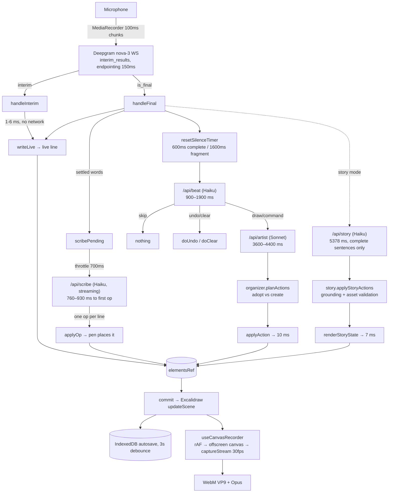

# InPublic — evidence-based audit (2026-08-09)

Method: repository inspection, `npm run typecheck`, `npm test`, `next build`, and a
live dev server at `localhost:3210` driven through the in-app `window.inpublic`
test harness with real Deepgram / Anthropic / Gemini keys from `.env.local`.
Every timing below was measured on this machine unless explicitly labelled an
estimate.

**Hard blocker, stated up front:** the Browser pane blocks `getUserMedia`
(`NotAllowedError: Permission denied`) and reports `document.visibilityState ===
"hidden"` with `requestAnimationFrame` firing **0 times per second**. So
microphone capture, the true mic→ink latency, and the visual fidelity of a
recorded WebM could not be exercised end to end. Everything downstream of the
transcript was driven directly and is measured; everything upstream of it is
traced and estimated, and labelled as such.

---

## 1. Executive verdict

**InPublic today is a working live sketchnote engine for Standard Mode, with a
separate, slower, structurally-sound Story Mode bolted alongside it. It is not
yet a voice-commandable visual storyteller.**

What is genuinely real:

- A three-tier rendering architecture where the fast tier is *actually fast*.
  `writeLive` puts spoken words on the Excalidraw canvas in **1–6 ms** (measured,
  `components/Board.tsx:1036`). There is no model, no network and no debounce on
  that path. Step 2 of the vision — "words appear continuously while the user is
  still speaking" — is architecturally solved.
- A real semantic layer. The canvas is not text-on-screen: it is Excalidraw
  rectangles, bound arrows with `startBinding`/`endBinding`, and procedurally
  drawn cats and palm trees made of ellipses and lines. Everything is a fully
  editable object.
- A real operation/undo model, real IndexedDB persistence that survives refresh,
  and four export formats that all produce non-empty valid files.

What is not real:

- **Voice commands do not work as a user would understand them.** Verified: say
  "Scratch that." and the system letters the words *"Scratch that."* onto the
  canvas as narration, then ~2 s later undoes **the live line containing those
  very words** — leaving the thing the user wanted to retract untouched. It
  looks like it worked because something vanished. It undid itself.
- The visual-response loop is **5–8 seconds** end to end for anything structural
  (measured), because it is gated on 600 ms of silence, then a Haiku beat call,
  then a Sonnet artist call. That is not "while you continue speaking".
- Screenshots, images, animation, scene transitions, collaboration, and sharing
  are **entirely absent** — not partial, not stubbed. Zero image support exists
  anywhere in the codebase.
- Authentication is a `localStorage` email string with no password and no server
  boundary (`lib/auth.ts`, honestly documented as such). There is no database and
  no server-side storage of anything.

**Distance to the vision: steps 1, 2 and (partly) 4 exist. Step 3 exists but
slowly. Step 5 is broken. Step 6 exists as a local WebM + JSON, with no share.**

---

## 2. Verified user journey

| # | Step | What actually happened |
|---|---|---|
| 1 | Landing `/` | Renders fully. All nav anchors and CTAs resolve. |
| 2 | Nav / CTAs | Every route returns 200: `/pricing /login /contact /privacy /terms /dashboard/*`. `/dashboard/assets` correctly 302s to `/dashboard/vocabulary`. **"Join the Discord" goes to `discord.com`** because `NEXT_PUBLIC_DISCORD_URL` is unset. |
| 3 | Sign up / sign in | `/login` takes any email, no password, writes `localStorage["inpublic-auth"]`, redirects to `/dashboard`. Nothing is gated by it. |
| 4 | Dashboard | Renders, greets, lists sessions read from IndexedDB. Correct data. |
| 5 | Create / open project | `/create?mode=standard&new=1` and `?session=<id>` both work; mode and session id are honoured (`app/create/page.tsx`). |
| 6 | Canvas | Excalidraw mounts (2 canvases), zen mode on, full editing toolbar available, `window.inpublic` harness present. |
| 7 | Start microphone | **BLOCKED** — `getUserMedia` denied by the browser pane. Deepgram credential minting verified working separately (`/api/deepgram/token` → 200, `accessToken`, `expiresIn: 60`). |
| 8–9 | Speak 30–60 s / partials | **Not testable.** Simulated instead: 6 successive interims of a growing sentence rendered in `[29, 2, 6, 1, 1, 1]` ms, final in 1 ms, producing exactly **one** text element that is patched in place (identity preserved across partials). |
| 10 | Canvas response | Scribe tier verified live: `inpublic.scribe("The main problem is trust, and the second problem is latency.")` → **711 ms** → 2 marks lettered (`word "trust"`, `word "latency"`). Structural tier verified: artist actions → 2 boxed concepts + 1 bound arrow in **10 ms**. |
| 11 | Voice commands | Verified against the real `/api/beat`. Results in §7. **"Go back to the beginning" → `skip` (nothing happens). "Scratch that" undoes itself.** |
| 12 | Stop/resume recording | Pause/Resume/Stop all drive `MediaRecorder` correctly; duration excludes paused time (`hooks/useCanvasRecorder.ts:330-345`). Verified by clicking the real buttons. |
| 13 | Edit generated elements | Excalidraw is in full edit mode (`viewModeEnabled={false}`); elements are ordinary Excalidraw objects, so yes. |
| 14 | Finish recording | Produced a `video/webm;codecs=vp9` blob, saved to IndexedDB, "Recording saved locally" panel appeared. **But the blob was 898 bytes for 3.9 s** — because rAF never fired in a hidden tab. See §8. |
| 15 | Preview / export | **There is no in-app player.** "Preview" is a size/duration string. Export produced: PNG 58 003 B, SVG 11 101 B, `.excalidraw` 9 975 B, scene JSON 34 420 B — all verified non-empty with correct MIME types and filenames. |
| 16 | Refresh | **Verified.** After reload, 17 elements, the semantic board, and the Story state all restored; log recorded `restored 17 elements`. |
| 17 | Failure states | Deepgram reconnect has capped exponential backoff + user banner. Scribe failure falls back to a local no-model sketcher and shows a banner after 3 failures. Beat/artist failures return `skip`/`[]` and never touch the canvas. All present in code; the network-failure paths were not fault-injected. |

---

## 3. Feature status matrix

| Feature | Status | Evidence | Files / functions | User-visible consequence |
|---|---|---|---|---|
| Streaming STT (Deepgram nova-3) | **Present but unverified** | Token mints (200, 60 s TTL). `interim_results: true`, `endpointing: 150`, `utterance_end_ms: 1000`. Audio never flowed. | `hooks/useDeepgram.ts:203-275`, `app/api/deepgram/token/route.ts` | Cannot confirm real mic→partial latency |
| Live line (words while speaking) | **Verified working** | 1–6 ms per interim; single patched element | `Board.tsx:1036 writeLive`, `lib/ops.ts buildLiveLine` | Words appear essentially instantly once a partial arrives |
| Scribe tier (marks, icons, links) | **Verified working** | first op 760–930 ms, total 770–1210 ms, 3 ops streamed line-by-line | `app/api/scribe/route.ts`, `Board.tsx:1291 runScribe`, `lib/prompts.ts SCRIBE_SYSTEM` | Rough marks land ~1 s behind the words |
| Beat (what to do) | **Verified working** | 901–1916 ms warm, 2987 ms cold; returns `draw/command/undo/section/skip` | `app/api/beat/route.ts`, `Board.tsx:2171 runBeat` | The pause before any structure appears |
| Artist (structural edit) | **Verified working** | 3616 / 4353 ms, returned 8 valid actions referencing existing conceptIds | `app/api/artist/route.ts`, `lib/prompts.ts ARTIST_SYSTEM` | The dominant latency cost of the whole product |
| Semantic board + bound arrows | **Verified working** | `create_concept ×2 + create_relationship` applied in **10 ms**; arrow has real `startBinding`/`endBinding` | `lib/semantic.ts`, `Board.tsx:1615 applyAction`, `lib/routing.ts` | Arrows re-route when nodes are dragged |
| Organizer (adopt vs. duplicate) | **Verified working** | Test suite: `adopted airline <- "Airline"` rather than a second box | `lib/organizer.ts planActions` | The board does not fill with duplicates |
| Reference-and-return ("going back to X") | **Verified working (offline)** | Pipeline test D: resolved to page 0, drew there, returned camera | `lib/reference.ts`, `Board.tsx enterReference` | Works only via the beat→artist path, so 5–8 s |
| Story Mode interpreter | **Partially working** | Live call: 5378 ms, confidence 0.95, 8 actions — but **the sun was rejected**: `asset sun is incompatible with kind object` | `app/api/story/route.ts`, `lib/story.ts:888` | Weather silently never appears when the LLM path is used |
| Story rendering (procedural) | **Verified working** | Applied in **7 ms**; cat = 7 elements, palm tree = 5 (ellipses + lines) | `lib/storyAssets.ts buildStoryEntityElements` | Real editable sketches, not images |
| Story gating | **Verified working as designed** | `/api/story` returns `{incomplete: true}` unless `isThoughtComplete` | `app/api/story/route.ts:26`, `lib/pagination.ts` | Story Mode never draws mid-sentence |
| Undo / "scratch that" | **Broken** | Verified: undo removed the `live_line` holding the words *"Scratch that."*; the concept `Trust` survived | `lib/semantic.ts:356 lastMeaningful`, `Board.tsx:1574 doUndo`, `Board.tsx:1140` | The command erases itself and nothing else |
| Scribe marks are undoable | **Broken / missing** | `applyOp` never calls `recordOperation`; history contained no entries for `trust`/`latency` | `Board.tsx:944 applyOp` | "Scratch that" can never remove a Scribe mark |
| Command words removed from narration | **Missing** | `handleFinal` calls `writeLive(text, true)` unconditionally before any command routing | `Board.tsx:2625-2663` | "Make that bigger" is lettered on the board as content |
| Pagination / page turns | **Verified working** | Deferred soft turns, hard overflow turns, mid-thought carry of the live line | `lib/pagination.ts decidePageTurn`, `Board.tsx:634 turnPage` | Sheets don't flip mid-sentence |
| Persistence (IndexedDB) | **Verified working** | 17 elements + semantic + story survived a full reload | `lib/persist.ts`, `Board.tsx:2834` | A refresh does not lose a take |
| Exports PNG/SVG/excalidraw/JSON | **Verified working** | 58 KB / 11 KB / 10 KB / 34 KB, correct MIME + filenames | `lib/exports.ts` | Real, openable artifacts |
| Canvas video recording | **Partially verified** | Prior artifact `output/playwright/inpublic-recording.webm`: valid EBML, **10 clusters, V_VP9, no audio track**, 110 KB. My run in a hidden tab: 898 B, `duration: null`, would not play. | `hooks/useCanvasRecorder.ts:144 drawFrame` | Works when the tab composites; **produces an empty file if backgrounded** |
| Microphone audio in the recording | **Present but unverified** | No artifact anywhere contains an `A_OPUS` track | `useCanvasRecorder.ts:265` | A/V sync claim is untested |
| Webcam PiP | **Present but unverified** | Code composites a mirrored rounded PiP; camera blocked here | `useCanvasRecorder.ts:173-190` | — |
| Recording playback / preview | **Missing** | No `<video>` element anywhere except the camera preview | `RecordingPanel.tsx:131-137` | You must download the WebM to find out if it worked |
| Cursor capture | **Missing** | `drawFrame` copies canvases only | `useCanvasRecorder.ts:155-171` | Cursor never appears in the video |
| Screen capture | **Missing** | No `getDisplayMedia` anywhere | — | — |
| Replayable event timeline | **Present, unused** | A full timestamped `LogEvent[]` is persisted and exported, but nothing replays it | `lib/sessionLog.ts`, `lib/types.ts` | Latent capability, no player |
| Images / screenshots on canvas | **Missing** | Zero hits for `type:"image"`, `addFiles`, `fileId`, paste handling | — | The vision's "screenshots" does not exist |
| Animation / scene transitions | **Missing** | Only a 250 ms 5-step opacity `fadeIn`; positions are recomputed, never tweened | `Board.tsx:1451 fadeIn` | Elements pop in and jump |
| Collaboration / share links | **Missing** | No sharing code of any kind | — | "Share" on the landing page means "download and post it yourself" |
| Auth | **Mocked (honestly)** | Email string in `localStorage`, no password, no server check | `lib/auth.ts` | No account system; nothing is protected |
| Database / cloud storage | **Missing** | Everything is IndexedDB + localStorage | `lib/persist.ts`, `lib/recordings.ts` | Clearing site data destroys all work |
| Billing | **Mocked (honestly)** | `billing.configured = false`, upgrade button `disabled` | `lib/billing.ts`, `SettingsForm.tsx` | Pricing page states no charge can be made |
| Vocabulary editor | **Dead** | Writes `localStorage["inpublic-vocabulary"]`; **grep confirms nothing reads it** | `components/VocabularyEditor.tsx:10-11` | Editing it changes nothing about recognition |
| Gemini Live engine | **Present, inactive** | `NEXT_PUBLIC_ENGINE=deepgram`; token route works | `hooks/useGeminiLive.ts` (368 lines) | Second full engine carried but unused |
| Tests | **Verified working** | 53 + 61 + 12 checks pass; typecheck clean; `next build` clean | `scripts/*.mjs` | Good regression safety on pure logic |
| Lint | **Missing** | No `eslint` dependency, no config, no `lint` script — yet `Board.tsx:2921` has an `eslint-disable` comment | `package.json` | No style/correctness gate |

---

## 4. Architecture and data flow

Three independent tiers write to one `elementsRef` and one `commit()`. That
separation is the best decision in the codebase: a slow model can never block
the fast hand.



Stage-by-stage:

| Stage | Runs | Key constants | Ordering | Failure behaviour |
|---|---|---|---|---|
| Audio capture | continuous | `recorder.start(100)` — hard 100 ms floor | n/a | mic denied → red status + banner |
| Deepgram | continuous | `endpointing: 150`, `utterance_end_ms: 1000`, keyterms fixed at connect | in-order | capped backoff `[400,900,2000,4000,8000]`, max 12 attempts, stream reused so no re-prompt |
| Live line | per interim | none | `liveSeqRef` guard drops stale builds | pure local, cannot fail |
| Scribe | throttled | `SCRIBE_INTERVAL_MS = 700`, `SKETCH_TOUCH_LOCK_MS = 1500`, max 5 ops | single-flight + one queued; **aborts the previous call** | 3 failures → banner, falls back to `growSketch` (no model) |
| Beat | on silence | `SILENCE_MS = 600`, `FRAGMENT_GRACE_MS = 1600`, `MIN_WORDS = 4`, `MAX_PENDING_WORDS = 120` | single-flight, one queued; suppressed while a render is pending | any failure → `skip`, canvas untouched |
| Artist | after a non-skip beat | `maxTokens: 1200`, `allowThinking` | shares the beat's `AbortController` | failure → `actions: []`, pending text **not** retired |
| Apply | sync | `TOUCH_LOCK_MS = 4000` waits for idle hands | sequential | per-step try/catch, returns a reason string |
| Story | per complete sentence | `maxTokens: 1000` | FIFO queue, single-flight | falls back to `interpretStoryDeterministically` |
| Record | rAF | `captureStream(30)`, `recorder.start(1000)`, 20 min cap | n/a | `onerror` → banner; interrupted takes are disclosed on next load |

**Out-of-order risk:** low and deliberately guarded. `liveSeqRef`, `storyCaptionSeqRef`,
single-flight flags and per-tier `AbortController`s all exist. **Head-of-line
blocking:** `renderBeat` calls `waitForIdleHands()` which sleeps until 4 s after
the last user input — so touching the canvas while talking can stall structural
drawing indefinitely (`Board.tsx:458`).

---

## 5. Latency findings

Measured on this machine, dev server, real keys:

| Stage | Measured |
|---|---|
| `writeLive` one interim → ink | **1–6 ms** (first call 29 ms) |
| `/api/scribe` → first drawable op | **760, 833, 928 ms** (cold 3205 ms) |
| `/api/scribe` complete | 769, 840, 1214 ms |
| `/api/beat` | **901, 996, 997, 1131, 1182, 1503, 1736, 1916 ms**; cold 2987 ms |
| `/api/artist` | **3616, 4353 ms** |
| `/api/story` | **5378 ms** |
| `applyActions` (2 concepts + bound arrow) | **10 ms** |
| `applyStoryBatch` (scene + 2 entities + relation) | **7 ms** |
| Story deterministic fallback (no network) | **0.75–6.15 ms** (test suite) |
| Deepgram token mint | 2234 ms |
| Stop → "Recording saved locally" | ~1–2 s |

Derived end-to-end (the parenthesised part is the unmeasurable mic→Deepgram leg):

| Vision moment | Time |
|---|---|
| Speech begins → first visible partial text | (est. 250–500 ms) + 1–6 ms render |
| Spoken phrase → finalized transcript | (est. 150–600 ms after the pause) |
| Spoken thought → first Scribe mark | ≤700 ms throttle + 760–930 ms ≈ **1.5–2.0 s** behind the words |
| Spoken thought → first structural diagram | 600 ms (or 1600 ms) + 0.9–1.9 s + 3.6–4.4 s + 10 ms = **5.1–7.9 s** |
| Voice command → completed canvas action | same path: **5–8 s** (except undo-type commands, which skip the artist: **~1.8 s**) |
| Story sentence → scene change | complete sentence + 5.4 s ≈ **6 s** |
| Stop recording → playable result | 1–2 s to a blob; **no in-app playback exists** |
| Finish → exportable/shareable | exports are instant; **there is no share** |

### The ~1.5-second-after-you-stop-talking behaviour

**Cause: a combination, dominated by two things — and one of them is a config
question, not a code bug.**

1. **Not** non-streaming recognition. `interim_results: true` is set and
   `handleInterim` renders in 1–6 ms. The fast path is genuinely fast.
2. **Not** client-side debounce on the words. There is none on `writeLive`.
3. **Endpointing/finalisation, partly.** `endpointing: 150` + `utterance_end_ms:
   1000` govern when Deepgram *finalises*. If the symptom was "the grey text goes
   black ~1.5 s after I stop", that is exactly the ~1 s utterance-end plus round
   trip, and it is expected.
4. **Audio chunking, partly.** `recorder.start(100)` is a hard 100 ms floor, plus
   the Opus encoder's own buffering. Irreducible without switching to raw PCM via
   an `AudioWorklet`.
5. **The likely dominant historical cause: the engine.** `.env.local` carries the
   note *"Gemini Live only emits at end-of-turn, which is where the 17-second
   gaps came from"*, and `Board.tsx:2752` confirms Gemini's drawing only arrives
   at end-of-turn. If the 1.5 s observation predates `NEXT_PUBLIC_ENGINE=deepgram`,
   it was the engine and it is already fixed.
6. **The "only text appears" half is a different problem, and it is real.** The
   *only* thing that can appear while you speak is the live line — plain lettered
   text. Icons/boxes need the Scribe (+1.5–2 s); diagrams need beat+artist
   (+5–8 s). So a short utterance genuinely produces *nothing but text*, forever,
   because the utterance ends before the structural tiers ever fire.

**How to get the exact number without me:** the instrumentation already exists.
Run one 60 s take and press **Log** on the control bar. Every `live` event
carries `lagP50` / `lagMax`, computed as ink-time minus Deepgram's own audio
timeline (`useDeepgram.ts:98`, `Board.tsx:1157-1178`). That is the true mic→ink
latency and it needs a working microphone, which I did not have.

---

## 6. Canvas and visual-intelligence findings

**Canvas technology:** Excalidraw 0.18 in full edit mode, plus
`@excalidraw/mermaid-to-excalidraw`. Everything the AI draws is an ordinary
Excalidraw element the user can select, drag, restyle and delete.

| Capability | Status |
|---|---|
| Freehand, shapes, manual text, zoom/pan, native undo | **Working** — Excalidraw's own toolbar, zen mode on |
| AI-placed text (title/heading/word/note/bullet/box) | **Working** — `lib/ops.ts` |
| Arrows / connections | **Working, bound at both ends**, with obstacle-avoiding routing (`lib/routing.ts`); live-line rows are soft obstacles |
| Icons | **Working** — 21 hand-coded procedural pictograms, `lib/icons.ts` |
| Images / screenshots | **Missing entirely** |
| Grouping | **Working** — `group_concepts` draws a ring; not an Excalidraw group |
| Layout | **Deterministic, not improvised.** No model ever emits a coordinate. A single "pen" flows left-to-right, top-to-bottom on a 1040×780 sheet with 44 px padding (`lib/ops.ts:181-260`); Story uses fixed zones + relative resolution (`storyAssets.ts:130`) |
| Movement / animation | **Missing** — only a 250 ms opacity fade; repositioning is instantaneous |
| Scene transitions | **Missing** — a "page turn" is a camera jump to the next sheet |
| Editing | **Working** |
| Undo/redo | **Partial.** Semantic undo reverses one operation but includes live lines and excludes Scribe marks. Ctrl+Z is deliberately left to Excalidraw and the two histories are unaware of each other |
| Persistence | **Working** (IndexedDB) |
| Collaboration | **Missing** |
| Export | **Working** (PNG/SVG/.excalidraw/JSON) |

### What the AI can actually cause

- **Structured operations, not prose.** Both modes return typed JSON action
  arrays that are parsed and validated before touching the canvas
  (`lib/actions.ts parseActions`, `lib/story.ts parseStoryActions`).
- **There is a real object model.** `SemanticBoard` holds `Concept`,
  `Relationship`, `Section`, and an `Operation` history with full `UndoRecord`s
  (whole elements, not diffs). Story has `StoryState → scenes → entities →
  renderings`, plus relations.
- **It can reference and modify existing elements.** Verified: the artist was
  handed existing conceptIds and reused them; `board.match()` plus
  `organizer.planActions` turn "create Airline" into `adopted airline <- "Airline"`,
  ringing the words already on the sheet rather than drawing a second copy.
- **It knows what is visible** — the beat receives loose words, drawn diagrams,
  and the semantic board as three separately-labelled lists.
- **It maintains context** across a developing explanation (90 s transcript
  window, 40-word Scribe context, section history).
- **New scene vs. elaboration:** Standard distinguishes via `action: "section"`;
  Story via `create_scene` / `activate_scene`. Both worked in testing —
  though note `activate_scene` was rejected in my run as *"scene activation is
  not explicit"*.
- **People, objects, time, goals, problems, comparisons, relationships:** partly.
  Standard has `kind: input|process|output|person|product|problem|solution|goal|note`
  — so problems and goals are representable, but time/comparison have no
  first-class form. Story has entities with pose/action/direction/appearance and
  8 relation types.
- **It can revise without redrawing.** `update_concept`, `move_concept`,
  `resize_concept`, `highlight_concept`, `transform_entity`, `set_entity_visibility`
  all mutate in place.
- **Clutter control:** a hard dedupe on mark keys, `MAX_MARKS_PER_PAGE = 22`
  triggering a deferred page turn, an 8-action cap on the artist, a 5-op cap on
  the Scribe, the organizer's adopt-before-create, and a `groundedInSource` gate
  that refuses to letter words the speaker did not say.

### Exact data structures on the wire

Artist → canvas (captured live from `/api/artist`):

```json
{"actions":[
  {"type":"create_concept","conceptId":"airline","label":"Airline","kind":"product","confidence":0.8},
  {"type":"create_concept","conceptId":"ai-agents","label":"AI Agents","kind":"process","confidence":0.8},
  {"type":"create_relationship","fromConceptId":"airline","toConceptId":"ai-agents",
   "relationshipType":"powers","label":"infrastructure for","confidence":0.8}
]}
```

Scribe → canvas (newline-delimited ops, streamed):

```
title "Airline"
heading "Infrastructure for AI agents"
word "mass calling"
bullet "sandboxing"
```

Story → canvas (captured live from `/api/story`):

```json
{"type":"create_entity","entityId":"cat-1","kind":"animal","assetKey":"cat","label":"cat",
 "aliases":["the cat","it"],"state":{"pose":"sitting","visible":true},
 "placement":{"zone":"center","relativeTo":"palm-tree-1","relation":"under"}}
```

Resulting canvas objects (verified): `{text: 4, rectangle: 1, line: 10, ellipse: 2}`
— a cat is 7 real elements, a palm tree 5. Arrows carry
`startBinding.elementId` / `endBinding.elementId`.

**Verdict: these are real editable objects, not text or image output.** That is
the single strongest thing in this codebase.

---

## 7. Voice-command findings

**Status: partially implemented, and the part that is implemented is wrong in a
way that hides itself.**

How it works: there is no dedicated command channel. Every finalized utterance
goes to `writeLive` as narration *and* into `pendingText`, and 600 ms later the
same beat call that decides whether to draw also decides whether it was a
command. Detection is therefore **model-based on finalized transcripts only**,
with two small rule-based exceptions: `lib/reference.ts` regex-detects "going
back to X", and Story Mode regex-matches `^(scratch that|no wait|forget
that|that's wrong)` (`Board.tsx:2439`).

Tested against the live `/api/beat` with a populated board:

| Phrase | Beat decision | Latency | Actual result |
|---|---|---|---|
| "Go back." | `undo` | 1916 ms | **Wrong intent** — treated as retraction, not navigation |
| "Remove that." | `undo` | 997 ms | Reverses the last operation, not a selected element |
| "Make that bigger." | `command` → `resize_concept` | 901 ms + ~4 s artist | Plausible, but ~5 s |
| "Show the connection." | `command`, focus *"Connect Airline to AI Agents with a line labeled 'powers'"* | 1503 ms + ~4 s | Correct intent, ~5.5 s |
| "Scratch that." | `undo` | 1182 ms | **Undoes itself — see below** |
| "Go back to the beginning." | **`skip`** | 1131 ms | **Nothing happens at all** |

**The self-undo defect (verified, not inferred).** Sequence reproduced in the
browser:

1. `create_concept trust` → history `[..., create_concept:op_7]`
2. Speak "Scratch that." → `handleFinal` letters it via `writeLive(text, true)`,
   which calls `recordOperation("live_line", …)` (`Board.tsx:1140`) →
   history `[..., create_concept:op_7, live_line:op_8]`
3. Beat returns `undo` → `doUndo()` → `lastMeaningful()` skips only
   `zoom_to_concept` and `highlight_concept` (`lib/semantic.ts:356-365`), so it
   returns **`live_line:op_8`**
4. Canvas text before: `[…, "Trust", "Scratch that."]` → after: `[…, "Trust"]`

The concept survives; the command's own words are what disappear.

Other findings:

- **Command words are never removed from narration.** They are lettered on the
  canvas before anything decides they were a command, and they are permanently in
  `finalsRef` — which is what the recording transcript and the session title are
  built from.
- **Scribe marks are immune to undo.** `applyOp` never records an operation, so
  "scratch that" can never remove a lettered word or an icon.
- **Commands cannot refer to previous moments.** They can refer to *concepts*
  ("this"/"that" → most recent) and to *pages* via the separate `detectBackReference`
  regex, but there is no addressing of "the thing I drew two minutes ago".
- **Nothing runs on partial transcripts.** A command is never detected until the
  utterance finalizes.
- **False positives:** the beat is explicitly tuned to *escalate* toward drawing
  after 3–5 skips (`BEAT_SYSTEM`), which biases it to invent structure from
  filler. Conversely "Go back to the beginning" shows a false negative.
- **Recovery from a misunderstood command:** only the same broken `undo`.

---

## 8. Recording and output findings

**What is recorded:** microphone audio (optional, on by default) and a
30 fps composite of the Excalidraw canvases, plus an optional mirrored webcam
PiP, an optional burned-in transcript, and an optional status badge — all
composited in `drawFrame` (`useCanvasRecorder.ts:144`).

**What is not recorded:** cursor movement, screen content, and any replayable
canvas-event track. The `LogEvent[]` timeline *is* captured and exported but
nothing replays it.

Verified:

- **Output format** — `video/webm;codecs=vp9`, `recorder.start(1000)`, capped at
  20 minutes (`FREE_RECORDING_LIMIT_MS`).
- **Prior artifact** `output/playwright/inpublic-recording.webm`: valid EBML
  header `1a45dfa3`, **10 clusters, `V_VP9` present, `A_OPUS` absent**, 110 604 B.
  So canvas video capture demonstrably works. **No artifact anywhere contains an
  audio track**, so audio capture and A/V sync are unverified.
- **Pause/resume** — verified by clicking the real controls; paused time is
  excluded from the duration.
- **Resolution** — output canvas is sized from the target rect scaled to 720p or
  1080p, rounded to even dimensions. My run produced 1280×720.
- **Persistence** — saved to the `recordings` IndexedDB store, keeping the newest
  5 (`FREE_SESSION_LIMIT`); metadata carries transcript, semantic snapshot, story
  state and the full log.
- **Editable state after recording** — yes; the canvas is untouched by recording.
- **Interrupted takes** — disclosed on next load via `inpublic-recording-active`.

Not verified / broken:

- **My recording produced an 898-byte, 3.9 s WebM that would not play**
  (`duration: null`, `currentTime` stuck at 0). Root cause established:
  `visibilityState === "hidden"` and **rAF fired 0 times in 1 s**, so `drawFrame`
  never painted. This is an environment artifact — **but it is also a real
  product risk**: browsers throttle rAF in hidden/minimised tabs, so anyone who
  alt-tabs mid-recording gets a frozen or empty video with no warning.
- **There is no way to watch a recording inside the app.** The "preview" is the
  string `00:03 · 0.0 MB · WebM`. Per your rule, I will not call this preview
  functional.
- **Browser compatibility** — VP9/WebM `MediaRecorder` means Safari support is
  doubtful; only Chromium was exercised.
- **Share links and access control** — **do not exist.** "Share in Discord" is an
  external link to `discord.com` (because `NEXT_PUBLIC_DISCORD_URL` is unset).

---

## 9. Reliability findings

- **`waitForIdleHands` can stall structural drawing indefinitely** — it loops
  until 4 s after the last pointer/key input (`Board.tsx:458`). Fidgeting with the
  canvas while narrating silently starves `renderBeat`.
- **Scribe self-cancellation.** `runScribe` calls `scribeAbortRef.current?.abort()`
  *before* creating its own controller, but a queued call re-enters via
  `queueMicrotask` — with a fast speaker this can abort work whose text has
  already been consumed (`scribePendingRef` is cleared at line 1317 **before** the
  fetch). On abort, that text is gone and is never re-scribed.
- **Deepgram keyterms are frozen at socket-open.** The most valuable terms are the
  ones that appear later; they only take effect on the next reconnect. Documented
  honestly in the code, but it is a real accuracy ceiling.
- **`recordOperation` is not called by `applyOp`** — the Scribe tier is outside
  the undo model entirely (see §7).
- **`lastMeaningful` treats a live line as meaningful** — the self-undo bug.
- **Story asset/kind contract mismatch** — `STORY_SYSTEM` lists `Kinds: character,
  animal, vehicle, object, location, background` and gives a sun example without
  specifying the kind; `lib/story.ts:278` requires `sun|cloud|rain → background`.
  Verified live: the model sent `kind:"object"` and the sun was silently dropped.
  The deterministic fallback gets it right, so the LLM path is *worse* than the
  fallback for weather.
- **Security:** provider keys are server-only and the product test asserts this
  (`client source does not read provider secrets` — passing). Deepgram credentials
  are 60 s scoped grants. **But** `lib/auth.ts` is not a security boundary,
  `/dashboard` and `/create` are not gated, and everything is client-side, so
  there is nothing yet to protect.
- **Data durability:** clearing site data destroys every session and recording.
  Recordings silently evict past 5.
- **No lint tooling at all**, despite an `eslint-disable` comment in `Board.tsx`.
- **`Board.tsx` is 3 185 lines** with ~60 refs in one component. It is unusually
  well-commented, but it is the single largest structural risk to changing
  anything.
- **Untested critical paths:** microphone→Deepgram, audio in recordings, A/V sync,
  webcam PiP, Safari/Firefox, network-failure injection, long (20 min) sessions,
  IndexedDB quota exhaustion.

---

## 10. Dead or misleading functionality

| Item | Reality |
|---|---|
| **Vocabulary editor** (`/dashboard/vocabulary`) | Writes `localStorage["inpublic-vocabulary"]`; **nothing reads it**. Recognition uses hardcoded `SEED_TERMS` + on-canvas marks. Its own fine print admits "Engine vocabulary sync is planned". |
| **"Join the Discord"** (landing, dashboard, recording panel) | `NEXT_PUBLIC_DISCORD_URL` unset → all three links open `discord.com`. |
| **"Share in Discord"** on a finished recording | Same generic link. No sharing exists. |
| **"Recording saved locally · 00:03 · 0.0 MB"** | Presented as a result panel; there is no playback and the size can legitimately be ~0. |
| **Landing page: "Record, export, and share"** | Record ✓, export ✓, **share ✗**. |
| **Landing page: Story Mode "Pose and action changes", "Story continuity"** | Genuinely implemented — but gated behind complete sentences and a ~6 s round trip, and weather silently fails on the LLM path. |
| **Pricing: "Saved cloud sessions"** | There is no cloud. Correctly hedged elsewhere ("Payments are not enabled"). |
| **Login page** | Accepts any email, no password, gates nothing. |
| **`useGeminiLive.ts`** (368 lines) + `/api/gemini/token` | Fully built second engine, inactive under `NEXT_PUBLIC_ENGINE=deepgram`. Competing architecture, carried but unused. |
| **`/dashboard/assets`** | Redirect stub to `/dashboard/vocabulary`. |
| **`lib/billing.ts`** | Deliberate honest stub; the upgrade button is `disabled`. Not misleading. |
| **`AUDIT.md`, `AUDIT-2.md`, `PLAN.md`** (1 661 lines) | Prior planning docs. I did not treat any of their claims as evidence. |
| **`LogEvent` timeline** | Fully captured, exported, never replayed. Latent, not dead. |
| **`window.inpublic` console harness** | A developer backdoor shipped to production (`Board.tsx:2948-3003`). Useful; worth knowing it is there. |

---

## 11. Direction comparison

### A. Live visual storyteller
- **Foundation:** ~60%. `lib/story.ts` (1 688 lines) + `storyAssets.ts` +
  `storyPrimitives.ts` are a genuine entity/scene/relation engine with 19 prepared
  assets, poses, actions, effects, grounding validation, and a deterministic
  fallback that runs in <7 ms. 61 tests pass.
- **Reuse:** the whole entity model, procedural rendering, and layout resolver.
- **Meaningful modification:** the interpreter must stop requiring complete
  sentences (`/api/story` line 26) and must run incrementally on partials; the
  asset/kind contract must be fixed; 5.4 s must become <1 s.
- **Replace:** the interpretation trigger, and probably the model choice.
- **Risks:** 19 assets is a hard vocabulary ceiling — anything outside it becomes
  a labelled box, which reads as a bug on camera. No animation, so a "cat runs
  toward the water" is a teleport. Highest creative variance, hardest to demo
  reliably.
- **Difficulty: hardest.**

### B. Live thinking canvas
- **Foundation:** ~80%. This is what the app already is. Live lettering, the
  Scribe, the semantic board, bound arrows with obstacle routing, the organizer's
  adopt-before-create, pagination, reference-and-return — all verified working.
- **Reuse:** essentially everything.
- **Meaningful modification:** collapse the 5–8 s structural path. The artist
  (3.6–4.4 s of Sonnet) is the whole problem and is the obvious target — a faster
  model, a smaller schema, or arrows-only responses.
- **Replace:** nothing structural. Fix undo/commands.
- **Risks:** lowest. The failure mode is "a bit slow", not "wrong picture".
- **Difficulty: easiest, by a wide margin.**

### C. AI presentation recorder
- **Foundation:** ~45%. Canvas capture and WebM export are real; audio and A/V
  sync are unverified; there is no playback, no timeline editing, no screenshots,
  no scene model, no share.
- **Reuse:** `useCanvasRecorder`, the export layer, the `LogEvent` timeline (which
  is a ready-made basis for a scene/replay editor).
- **Meaningful modification:** a player, a scene/slide abstraction, post-hoc
  editing.
- **Replace:** the whole notion of "output" — today it is a raw screen-capture of
  a canvas, not composed scenes.
- **Risks:** it is the direction furthest from what the code does, and the one
  where "it produced a file" is easiest to mistake for "it worked".
- **Difficulty: middle, but the largest amount of net-new product.**

**Recommendation: B, the live thinking canvas.** Not for novelty — because 80% of
it is verified working today, its remaining problem is a single measurable number
(the 3.6–4.4 s artist call), and it is the only direction that can produce a
convincing 60-second demo without new subsystems.

---

## 12. Recommended narrow prototype

**"Sixty seconds, one page, three arrows, one working command."**

- **What the user says/does:** presses Mic and explains one system for 60 seconds
  in 4–6 sentences — e.g. *"Airline is infrastructure for AI agents. Businesses
  use it for customer service and sales. The main problem is trust."* — then says
  **"Scratch that."** once, mid-take, and finishes.
- **What appears while they speak:**
  1. Their words, lettered live, within ~300 ms (already working).
  2. Within ~1 s of each phrase, 1–2 marks from the Scribe (already working).
  3. Within **≤2 s** of each completed thought, boxes ringed around the words
     already on the page and **arrows** drawn between them (today: 5–8 s — this
     is the one thing to fix).
- **Which voice commands work:** exactly **one** — "scratch that" / "remove that",
  and it must remove *the last drawn thing*, never its own words. That is the
  whole command surface for the prototype.
- **What the finished output contains:** one page, downloadable as PNG and as
  scene JSON, plus a WebM of the canvas with microphone audio that actually
  plays back inside the app.
- **Deliberately excluded:** Story Mode, webcam, screenshots, animation,
  multi-page, sharing, auth, billing, the vocabulary editor, the Gemini engine,
  and every voice command except undo.
- **Objective success criteria:**
  1. p50 phrase → first ink **< 500 ms**; p95 **< 900 ms**.
  2. p50 completed thought → first arrow **< 2 000 ms**; p95 **< 3 500 ms**.
  3. In a 60 s take: **≥ 3 bound arrows**, **0 duplicate concepts**, **0 overlaps**
     (the `checkLiveOverlap` logger already reports these).
  4. "Scratch that" removes the intended element and **does not remove its own
     words**, 5 times out of 5.
  5. The exported WebM opens in the app's own player, has an Opus track, and its
     audio is within 200 ms of the canvas changes.
  6. A refresh mid-take loses nothing (already true).

---

## 13. Prioritized next actions

### Fix immediately — blocks the core loop
1. **Exclude `live_line` from `lastMeaningful()`** (`lib/semantic.ts:356`). One
   line. Without it, every retraction command is a no-op that looks like a
   success.
2. **Stop lettering command phrases as narration.** Rule-match the small closed
   set (`scratch that|remove that|undo|go back|clear the board`) in
   `handleFinal` *before* `writeLive`, and strip them from `finalsRef` too
   (`Board.tsx:2625`).
3. **Record an operation for every Scribe mark** (`applyOp`, `Board.tsx:944`), so
   undo can reach lettered words and icons.
4. **Collapse the structural path below 2 s.** Measured budget: beat 0.9–1.9 s +
   artist 3.6–4.4 s. Options in order of leverage: drop the beat for a local
   heuristic; move the artist to a faster model; cap it to relationships-only.
   This is the single number that decides whether the product feels live.
5. **Fix the Story asset/kind contract** — either list the required kind per asset
   in `STORY_SYSTEM`, or coerce in `lib/story.ts:888` instead of rejecting.
   Today "it was a sunny day" silently draws nothing.
6. **Handle "go back to the beginning"** — it currently returns `skip`. Route
   page/scene navigation through `lib/reference.ts` rather than the beat.
7. **Guard `waitForIdleHands`** with a ceiling so canvas fidgeting cannot starve
   the renderer forever (`Board.tsx:458`).

### Preserve — already works, do not touch
- The three-tier architecture and the 1–6 ms live line (`writeLive`).
- The deterministic pen/layout system — no model emits coordinates. This is why
  the board never looks random.
- The semantic board, `organizer.planActions` adopt-before-create, and bound
  arrows with obstacle routing.
- `groundedInSource` — refusing to letter words the speaker did not say.
- The `Operation`/`UndoRecord` model (whole elements, not diffs).
- IndexedDB persistence and restore — verified across a full reload.
- The export layer, all four formats.
- The 126-check test suite, typecheck, and a clean build.
- The `LogEvent` instrumentation, including `lagP50`. Do not remove it — it is
  how you answer the latency question without me.

### Defer — does not help validate the core experience
- Story Mode entirely (until Standard is <2 s).
- The Gemini Live engine and `/api/gemini/token`.
- The vocabulary editor (either wire it up or delete it; leaving it is worse).
- Webcam PiP, burned-in transcript, the interface badge.
- Auth, billing, cloud storage, sharing, collaboration.
- Multi-page beyond page 1, `/dashboard/exports`, `/dashboard/community`.
- Screenshots/images, animation, scene transitions.

---

## 14. Questions requiring product decisions

1. **What does "go back" mean?** Retract the last thing, or navigate to an earlier
   page/scene? The beat currently guesses "retract". The code supports both.
2. **What is the acceptable structural latency?** 2 s is achievable by dropping
   the beat; ~500 ms probably requires abandoning a frontier model for structure.
   This is a cost/quality decision only you can make.
3. **Should commands ever be spoken silently, or is a keyboard/button fallback
   acceptable for the demo?** Push-to-command removes the entire narration/command
   disambiguation problem.
4. **Is Story Mode a product or a demo?** With 19 assets it cannot handle
   arbitrary stories. Either commit to a much larger asset system or scope it to
   a named genre.
5. **Local-only or cloud?** Everything today dies with the browser profile. Share
   links, access control, and "saved cloud sessions" on the pricing page all
   depend on this answer.
6. **Does the 60-second demo need webcam/face?** The stated motivation is *not*
   putting your face on screen — if so, webcam PiP is dead weight.
7. **Which browsers must work?** VP9 WebM effectively means Chromium-only today.

---

## Blunt answers

**1. Is the current application a viable foundation for the intended InPublic
experience?**
Yes — for the *thinking canvas* reading of that experience, and the foundation is
better than the vision document implies. The tier separation, the deterministic
layout, the semantic board and the operation history are the hard parts and they
are done and tested. It is **not** a viable foundation for "the canvas rearranges
scenes while you keep talking," because nothing on the canvas moves, animates, or
rearranges — new things are appended below old things.

**2. What is the strongest part worth preserving?**
The live line plus the deterministic pen. Words hit the canvas in 1–6 ms with no
model in the path, and every position is decided by client-side code rather than
an LLM. That combination is why the board is fast *and* never looks random, and
it is the thing a rewrite would most likely destroy.

**3. What is the biggest architectural constraint?**
The 3.6–4.4 s artist call, which sits behind a 600–1600 ms silence gate and a
0.9–1.9 s beat call. Nothing structural can appear until a person stops talking
and a frontier model finishes thinking. Everything the vision describes as
happening *while* the user speaks is blocked by that one chain. Second place:
`Board.tsx` at 3 185 lines is where all of this must be changed.

**4. What should we build next?**
The §12 prototype. Concretely, in this order: fix `lastMeaningful` so undo stops
undoing itself; strip command phrases from narration; get the completed-thought →
arrow path under 2 s; then build the in-app WebM player so "it recorded" can be
verified rather than assumed.

**5. What should we explicitly avoid building next?**
Story Mode expansion, the Gemini engine, screenshots/images, animation, sharing,
auth, billing, and cloud storage. Also avoid "finishing" the vocabulary editor —
delete it or wire it, but do not polish a control that changes nothing. And do
not rewrite `Board.tsx` before the latency fix; the tier separation you would be
refactoring is the part that already works.
